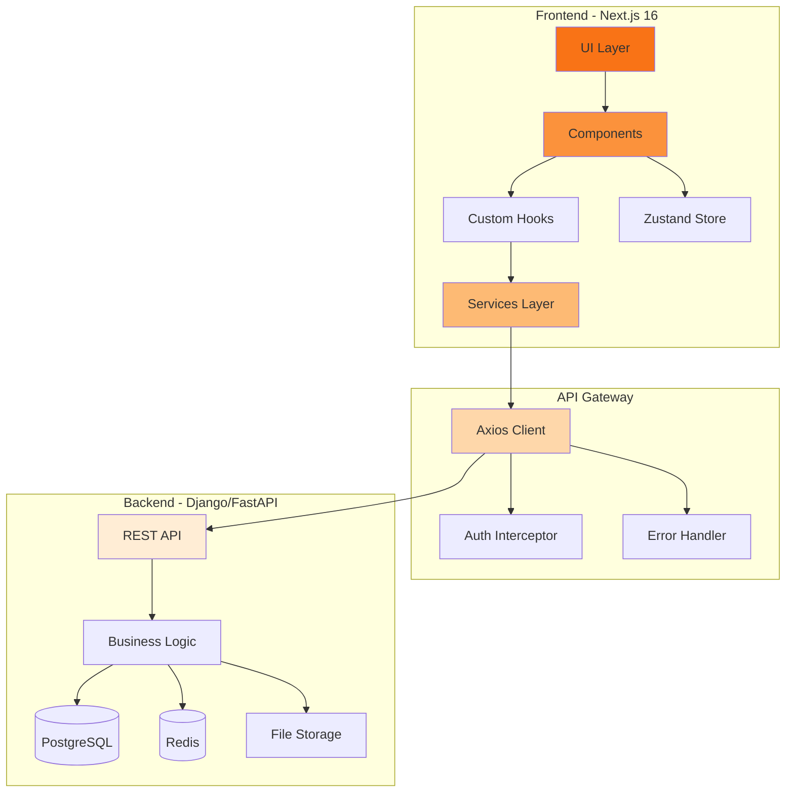
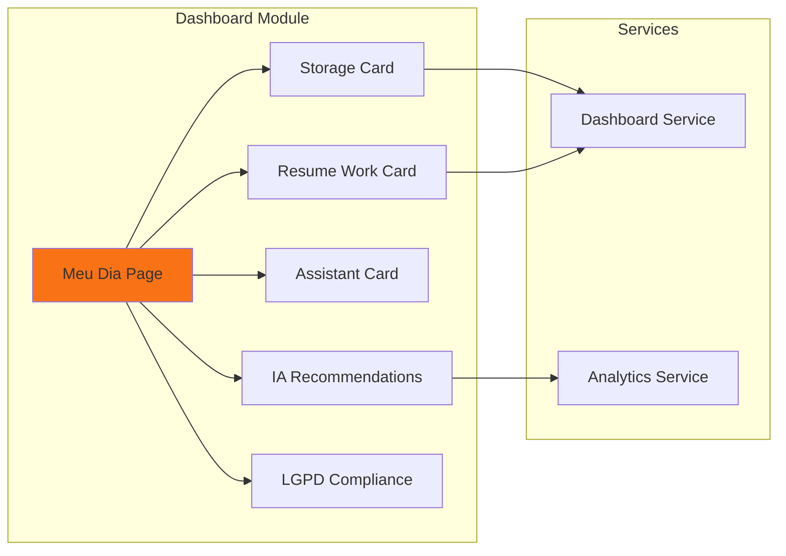
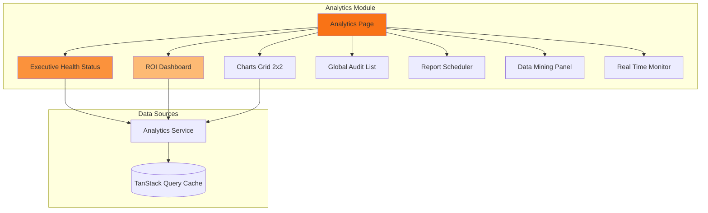
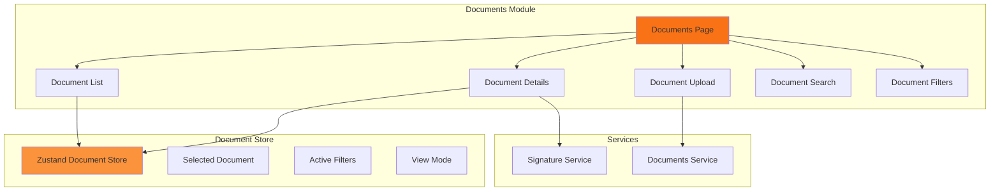
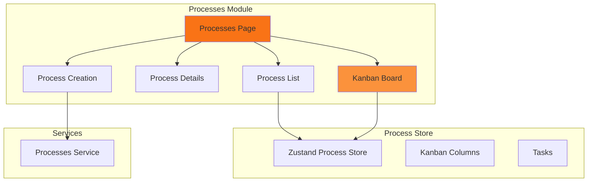
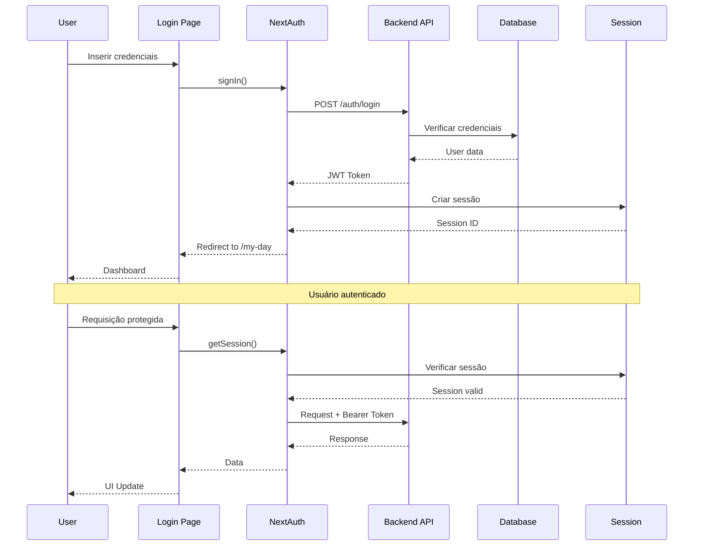
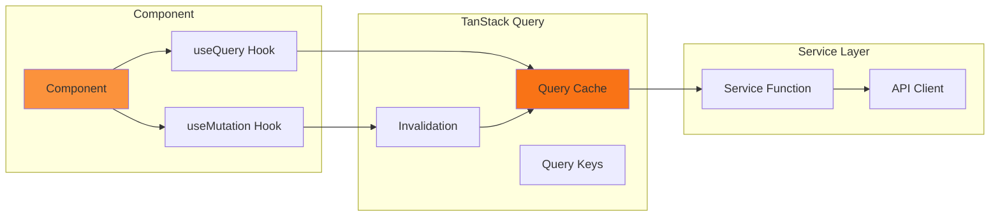
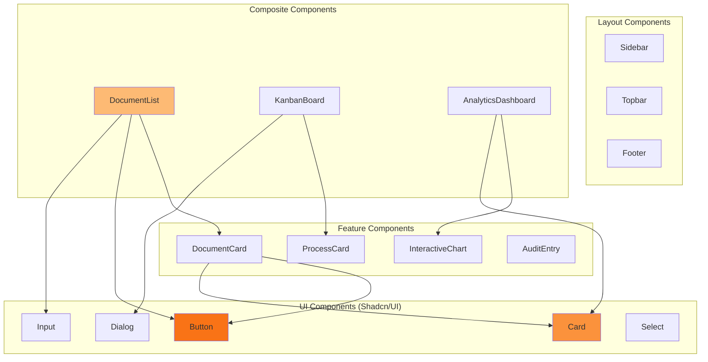

# Arquitetura - Ordoc-AI

## Diagrama de Arquitetura Geral



---

## Arquitetura de Módulos

### 1. Dashboard (Meu Dia)



**Responsabilidades:**
- Visão geral do dia do usuário
- Resumo de atividades pendentes
- Recomendações da IA
- Status de armazenamento
- Conformidade LGPD

---

### 2. Analytics



**Responsabilidades:**
- Métricas executivas de negócio
- ROI e valor gerado
- Análise preditiva (90 dias)
- Trilha de auditoria imutável
- Relatórios agendados
- Data mining e insights

---

### 3. Documents



**Responsabilidades:**
- Gestão de documentos (CRUD)
- Upload e download
- Visualização e preview
- Assinatura digital
- Versionamento
- Compartilhamento

---

### 4. Processes



**Responsabilidades:**
- Gestão de processos jurídicos/administrativos
- Workflow Kanban
- Tarefas e subtarefas
- SLA tracking
- Notificações

---

## Fluxo de Autenticação



### Tokens e Sessões

1. **Access Token**: JWT armazenado em `localStorage`
2. **Refresh Token**: Gerenciado pelo NextAuth
3. **Session**: Server-side session com NextAuth
4. **Expiração**: 24h (configurável)

---

## Fluxo de Dados (TanStack Query)



### Query Keys Strategy

```typescript
// Hierarquia de Query Keys
const queryKeys = {
  documents: ['documents'],
  document: (id: string) => ['documents', id],
  documentsByFolder: (folderId: string) => ['documents', 'folder', folderId],
  
  processes: ['processes'],
  process: (id: string) => ['processes', id],
  
  analytics: ['analytics'],
  analyticsKPIs: ['analytics', 'kpis'],
  analyticsCharts: (type: string) => ['analytics', 'charts', type],
}
```

---

## State Management (Zustand)

```mermaid
graph TB
    subgraph "Zustand Stores"
        DS[Document Store]
        PS[Process Store]
        US[UI Store]
    end
    
    subgraph "Document Store State"
        DOCS[documents: Document[]]
        SEL[selectedDocument: Document | null]
        FILT[filters: FilterState]
        VIEW[viewMode: 'grid' | 'list']
    end
    
    subgraph "Process Store State"
        PROCS[processes: Process[]]
        COLS[columns: Column[]]
        DRAG[draggedTask: Task | null]
    end
    
    subgraph "UI Store State"
        SIDE[sidebarOpen: boolean]
        THEME[theme: 'light' | 'dark']
        LANG[language: string]
    end
    
    DS --> DOCS
    DS --> SEL
    DS --> FILT
    DS --> VIEW
    
    PS --> PROCS
    PS --> COLS
    PS --> DRAG
    
    US --> SIDE
    US --> THEME
    US --> LANG
    
    style DS fill:#f97316
    style PS fill:#fb923c
    style US fill:#fdba74
```

### Exemplo de Store

```typescript
// src/store/documentStore.ts
interface DocumentStore {
  documents: Document[];
  selectedDocument: Document | null;
  filters: FilterState;
  viewMode: 'grid' | 'list';
  
  // Actions
  setDocuments: (docs: Document[]) => void;
  selectDocument: (doc: Document | null) => void;
  setFilters: (filters: FilterState) => void;
  toggleViewMode: () => void;
}

export const useDocumentStore = create<DocumentStore>((set) => ({
  documents: [],
  selectedDocument: null,
  filters: {},
  viewMode: 'grid',
  
  setDocuments: (docs) => set({ documents: docs }),
  selectDocument: (doc) => set({ selectedDocument: doc }),
  setFilters: (filters) => set({ filters }),
  toggleViewMode: () => set((state) => ({
    viewMode: state.viewMode === 'grid' ? 'list' : 'grid'
  })),
}));
```

---

## Diagrama de Casos de Uso

```mermaid
graph TB
    subgraph "Atores"
        USER[Usuário]
        ADMIN[Administrador]
        AI[Sistema IA]
    end
    
    subgraph "Casos de Uso - Documentos"
        UC1[Upload Documento]
        UC2[Assinar Documento]
        UC3[Compartilhar Documento]
        UC4[Versionar Documento]
        UC5[Buscar Documento]
    end
    
    subgraph "Casos de Uso - Processos"
        UC6[Criar Processo]
        UC7[Mover Tarefa Kanban]
        UC8[Atribuir Responsável]
        UC9[Monitorar SLA]
    end
    
    subgraph "Casos de Uso - Analytics"
        UC10[Visualizar ROI]
        UC11[Gerar Relatório]
        UC12[Consultar Auditoria]
        UC13[Receber Insights IA]
    end
    
    USER --> UC1
    USER --> UC2
    USER --> UC3
    USER --> UC5
    USER --> UC6
    USER --> UC7
    USER --> UC10
    USER --> UC11
    
    ADMIN --> UC4
    ADMIN --> UC8
    ADMIN --> UC9
    ADMIN --> UC12
    
    AI --> UC13
    AI -.-> UC9
    AI -.-> UC10
    
    style USER fill:#f97316
    style ADMIN fill:#fb923c
    style AI fill:#fdba74
```



---

## Diagrama de Componentes



---

## Performance e Otimização

### Code Splitting

```typescript
// Lazy loading de módulos
const Analytics = dynamic(() => import('@/components/analytics/AnalyticsPage'), {
  loading: () => <LoadingSpinner />,
  ssr: false
});

const Documents = dynamic(() => import('@/components/documents/DocumentsPage'), {
  loading: () => <LoadingSpinner />
});
```

### Caching Strategy

```typescript
// TanStack Query configuration
const queryClient = new QueryClient({
  defaultOptions: {
    queries: {
      staleTime: 5 * 60 * 1000, // 5 minutos
      cacheTime: 10 * 60 * 1000, // 10 minutos
      refetchOnWindowFocus: false,
      retry: 3,
    },
  },
});
```

### Image Optimization

```typescript
// Next.js Image component
import Image from 'next/image';

<Image
  src="/logo.png"
  alt="Ordoc-AI"
  width={200}
  height={50}
  priority
  quality={90}
/>
```

---

## Segurança

### Proteção de Rotas

```typescript
// middleware.ts
export function middleware(request: NextRequest) {
  const token = request.cookies.get('next-auth.session-token');
  
  if (!token && !request.nextUrl.pathname.startsWith('/login')) {
    return NextResponse.redirect(new URL('/login', request.url));
  }
  
  return NextResponse.next();
}

export const config = {
  matcher: ['/((?!api|_next/static|_next/image|favicon.ico).*)'],
};
```

### CSRF Protection

- NextAuth gerencia CSRF tokens automaticamente
- Todas as mutations usam POST/PUT/DELETE com tokens

### XSS Protection

- React escapa automaticamente JSX
- Uso de `dangerouslySetInnerHTML` apenas quando necessário e sanitizado

---

## Escalabilidade

### Horizontal Scaling

- Frontend: Deploy em múltiplos servidores (Vercel/AWS)
- Backend: Load balancer + múltiplas instâncias
- Database: Read replicas

### Vertical Scaling

- Otimização de queries
- Indexação de banco de dados
- Caching agressivo (Redis)

---

## Monitoramento

### Métricas Coletadas

- **Performance**: Core Web Vitals (LCP, FID, CLS)
- **Erros**: Error boundaries + Sentry
- **Analytics**: Google Analytics / Mixpanel
- **Logs**: Structured logging (Winston/Pino)

---

## Próximos Passos

- [API.md](./API.md) - Documentação de APIs
- [COMPONENTS.md](./COMPONENTS.md) - Guia de componentes
- [TESTING.md](./TESTING.md) - Estratégia de testes
