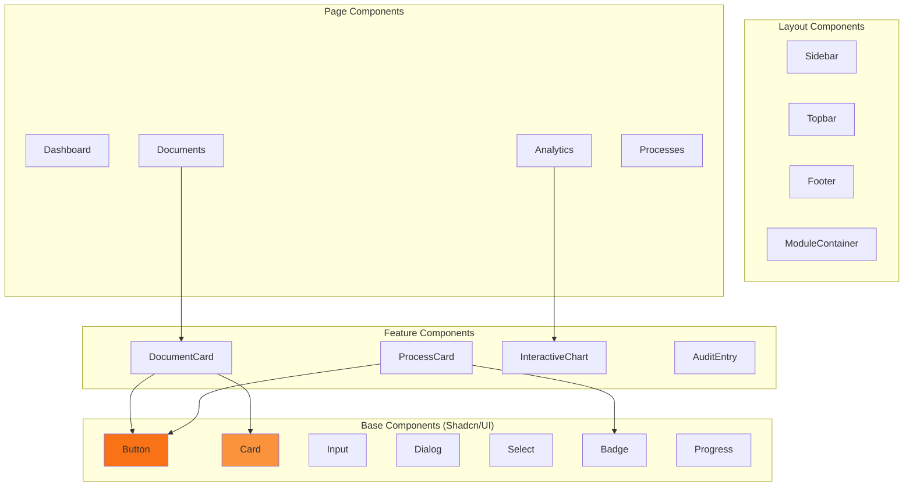

# Components Guide - Ordoc-AI

## Hierarquia de Componentes



---

## Base Components (UI)

### Button

**Localização:** `src/components/ui/button.tsx`

**Variantes:**
- `default`: Laranja sólido
- `outline`: Borda laranja
- `ghost`: Sem borda
- `destructive`: Vermelho (ações destrutivas)

**Tamanhos:**
- `sm`: Pequeno
- `default`: Médio
- `lg`: Grande
- `icon`: Apenas ícone

**Exemplo:**
```tsx
import { Button } from '@/components/ui/button';

<Button variant="default" size="lg">
  Clique aqui
</Button>

<Button variant="outline" size="sm">
  <Download className="mr-2" size={16} />
  Baixar
</Button>
```

---

### Card

**Localização:** `src/components/ui/card.tsx`

**Sub-componentes:**
- `Card`: Container principal
- `CardHeader`: Cabeçalho
- `CardTitle`: Título
- `CardDescription`: Descrição
- `CardContent`: Conteúdo
- `CardFooter`: Rodapé

**Exemplo:**
```tsx
import { Card, CardHeader, CardTitle, CardContent } from '@/components/ui/card';

<Card>
  <CardHeader>
    <CardTitle>Título do Card</CardTitle>
  </CardHeader>
  <CardContent>
    Conteúdo aqui
  </CardContent>
</Card>
```

---

## Layout Components

### Sidebar

**Localização:** `src/components/layout/Sidebar.tsx`

**Props:**
```typescript
interface SidebarProps {
  isOpen?: boolean;
  onToggle?: () => void;
}
```

**Funcionalidades:**
- Navegação principal
- Collapse/Expand
- Indicador de rota ativa
- Responsive (mobile drawer)

**Exemplo:**
```tsx
<Sidebar isOpen={sidebarOpen} onToggle={() => setSidebarOpen(!sidebarOpen)} />
```

---

### Topbar

**Localização:** `src/components/layout/Topbar.tsx`

**Funcionalidades:**
- Busca global
- Notificações
- Perfil do usuário
- Seletor de idioma

**Exemplo:**
```tsx
<Topbar />
```

---

## Feature Components

### DocumentCard

**Localização:** `src/components/documents/DocumentCard.tsx`

**Props:**
```typescript
interface DocumentCardProps {
  document: Document;
  onSelect?: (doc: Document) => void;
  onDelete?: (id: string) => void;
  onShare?: (id: string) => void;
  selected?: boolean;
}
```

**Funcionalidades:**
- Preview de documento
- Ações rápidas (download, compartilhar, deletar)
- Indicador de status (assinado, compartilhado)
- Drag and drop

**Exemplo:**
```tsx
<DocumentCard
  document={doc}
  onSelect={handleSelect}
  onDelete={handleDelete}
  selected={selectedId === doc.id}
/>
```

---

### InteractiveChart

**Localização:** `src/components/analytics/InteractiveChart.tsx`

**Props:**
```typescript
interface InteractiveChartProps {
  title: string;
  type: 'line' | 'bar' | 'pie';
  data: ChartData[];
  colors?: string[];
  height?: number;
  showLegend?: boolean;
  showTooltip?: boolean;
}
```

**Funcionalidades:**
- Múltiplos tipos de gráficos
- Interativo (hover, click)
- Responsivo
- Exportar como imagem

**Exemplo:**
```tsx
<InteractiveChart
  title="Processos ao Longo do Tempo"
  type="line"
  data={chartData}
  colors={['#f97316', '#fb923c']}
  height={300}
/>
```

---

### ExecutiveHealthStatus

**Localização:** `src/components/analytics/ExecutiveHealthStatus.tsx`

**Funcionalidades:**
- Status geral do sistema
- Métricas de negócio (4 KPIs)
- Insights acionáveis
- Disponibilidade do sistema

**Exemplo:**
```tsx
<ExecutiveHealthStatus />
```

**Dados Mock:**
```typescript
const mockBusinessMetrics = [
  {
    label: "Processos Este Mês",
    value: "1,247",
    change: 12.5,
    trend: "up",
    insight: "156 processos a mais que o mês passado",
  },
  // ...
];
```

---

### ROIDashboard

**Localização:** `src/components/analytics/ROIDashboard.tsx`

**Funcionalidades:**
- Valor gerado (R$)
- Horas economizadas
- Multas evitadas
- Automação de contratos
- Oportunidades de otimização

**Exemplo:**
```tsx
<ROIDashboard />
```

---

### GlobalAuditList

**Localização:** `src/components/analytics/GlobalAuditList.tsx`

**Funcionalidades:**
- Trilha de auditoria imutável
- Filtros por ação (criação, leitura, atualização, etc.)
- Busca por usuário, documento, IP
- Hash de integridade SHA-256

**Exemplo:**
```tsx
<GlobalAuditList />
```

---

## Hooks Customizados

### useDocuments

**Localização:** `src/hooks/useDocuments.ts`

**Funcionalidades:**
- Listar documentos
- Upload
- Delete
- Compartilhar

**Exemplo:**
```typescript
import { useDocuments } from '@/hooks/useDocuments';

function DocumentList() {
  const { data: documents, isLoading, error } = useDocuments();
  
  if (isLoading) return <Spinner />;
  if (error) return <Error message={error.message} />;
  
  return (
    <div>
      {documents.map(doc => (
        <DocumentCard key={doc.id} document={doc} />
      ))}
    </div>
  );
}
```

---

### useDocumentUpload

**Localização:** `src/hooks/useDocumentUpload.ts`

**Funcionalidades:**
- Upload com progresso
- Validação de arquivo
- Error handling

**Exemplo:**
```typescript
import { useDocumentUpload } from '@/hooks/useDocumentUpload';

function UploadButton() {
  const { upload, progress, isUploading } = useDocumentUpload();
  
  const handleFileChange = async (e: React.ChangeEvent<HTMLInputElement>) => {
    const file = e.target.files?.[0];
    if (file) {
      await upload(file);
    }
  };
  
  return (
    <div>
      <input type="file" onChange={handleFileChange} />
      {isUploading && <Progress value={progress} />}
    </div>
  );
}
```

---

## Stores (Zustand)

### Document Store

**Localização:** `src/store/documentStore.ts`

**Estado:**
```typescript
interface DocumentStore {
  documents: Document[];
  selectedDocument: Document | null;
  filters: FilterState;
  viewMode: 'grid' | 'list';
  
  setDocuments: (docs: Document[]) => void;
  selectDocument: (doc: Document | null) => void;
  setFilters: (filters: FilterState) => void;
  toggleViewMode: () => void;
}
```

**Exemplo:**
```typescript
import { useDocumentStore } from '@/store/documentStore';

function DocumentList() {
  const { documents, viewMode, toggleViewMode } = useDocumentStore();
  
  return (
    <div>
      <button onClick={toggleViewMode}>
        {viewMode === 'grid' ? 'Lista' : 'Grade'}
      </button>
      {viewMode === 'grid' ? (
        <GridView documents={documents} />
      ) : (
        <ListView documents={documents} />
      )}
    </div>
  );
}
```

---

## Design Patterns

### Composition Pattern

```tsx
// ❌ Prop Drilling
<DocumentList
  documents={docs}
  onSelect={handleSelect}
  onDelete={handleDelete}
  onShare={handleShare}
/>

// ✅ Composition
<DocumentList documents={docs}>
  {(doc) => (
    <DocumentCard
      document={doc}
      onSelect={handleSelect}
      onDelete={handleDelete}
      onShare={handleShare}
    />
  )}
</DocumentList>
```

---

### Render Props Pattern

```tsx
<DataFetcher url="/api/documents">
  {({ data, loading, error }) => {
    if (loading) return <Spinner />;
    if (error) return <Error />;
    return <DocumentList documents={data} />;
  }}
</DataFetcher>
```

---

### HOC Pattern

```tsx
function withAuth<P extends object>(Component: React.ComponentType<P>) {
  return function AuthComponent(props: P) {
    const { data: session } = useSession();
    
    if (!session) {
      return <Redirect to="/login" />;
    }
    
    return <Component {...props} />;
  };
}

const ProtectedPage = withAuth(Dashboard);
```

---

## Styling Guidelines

### Tailwind Classes

```tsx
// ✅ Usar classes do Tailwind
<div className="flex items-center gap-2 p-4 bg-orange-50 rounded-lg">

// ❌ Evitar inline styles
<div style={{ display: 'flex', padding: '16px' }}>
```

### Color Palette

```typescript
// Cores da plataforma
const colors = {
  primary: '#f97316',      // orange-500
  primaryLight: '#fb923c', // orange-400
  primaryDark: '#ea580c',  // orange-600
  
  background: '#ffffff',
  foreground: '#0f172a',   // slate-900
  muted: '#64748b',        // slate-500
};
```

### Responsive Design

```tsx
<div className="
  grid
  grid-cols-1
  md:grid-cols-2
  lg:grid-cols-3
  xl:grid-cols-4
  gap-4
">
```

---

## Accessibility

### Semantic HTML

```tsx
// ✅ Usar elementos semânticos
<nav>
  <ul>
    <li><a href="/documents">Documentos</a></li>
  </ul>
</nav>

// ❌ Evitar divs genéricas
<div>
  <div>
    <div onClick={...}>Documentos</div>
  </div>
</div>
```

### ARIA Labels

```tsx
<button aria-label="Deletar documento">
  <Trash2 size={16} />
</button>

<input
  type="text"
  aria-label="Buscar documentos"
  aria-describedby="search-help"
/>
<span id="search-help">Digite o nome do documento</span>
```

### Keyboard Navigation

```tsx
<div
  role="button"
  tabIndex={0}
  onClick={handleClick}
  onKeyDown={(e) => {
    if (e.key === 'Enter' || e.key === ' ') {
      handleClick();
    }
  }}
>
  Clique aqui
</div>
```

---

## Performance

### Code Splitting

```tsx
import dynamic from 'next/dynamic';

const HeavyComponent = dynamic(
  () => import('@/components/HeavyComponent'),
  {
    loading: () => <Skeleton />,
    ssr: false,
  }
);
```

### Memoization

```tsx
const MemoizedComponent = React.memo(({ data }: Props) => {
  return <div>{data.name}</div>;
}, (prevProps, nextProps) => {
  return prevProps.data.id === nextProps.data.id;
});
```

### Virtual Scrolling

```tsx
import { useVirtualizer } from '@tanstack/react-virtual';

function VirtualList({ items }: { items: Document[] }) {
  const parentRef = useRef<HTMLDivElement>(null);
  
  const virtualizer = useVirtualizer({
    count: items.length,
    getScrollElement: () => parentRef.current,
    estimateSize: () => 100,
  });
  
  return (
    <div ref={parentRef} style={{ height: '600px', overflow: 'auto' }}>
      <div style={{ height: `${virtualizer.getTotalSize()}px` }}>
        {virtualizer.getVirtualItems().map((virtualItem) => (
          <div
            key={virtualItem.key}
            style={{
              position: 'absolute',
              top: 0,
              left: 0,
              width: '100%',
              height: `${virtualItem.size}px`,
              transform: `translateY(${virtualItem.start}px)`,
            }}
          >
            <DocumentCard document={items[virtualItem.index]} />
          </div>
        ))}
      </div>
    </div>
  );
}
```

---

## Testing Components

### Unit Test

```tsx
import { render, screen } from '@testing-library/react';
import { DocumentCard } from './DocumentCard';

test('renders document name', () => {
  const doc = { id: '1', name: 'Test.pdf' };
  render(<DocumentCard document={doc} />);
  expect(screen.getByText('Test.pdf')).toBeInTheDocument();
});
```

### Integration Test

```tsx
import { render, screen, fireEvent } from '@testing-library/react';
import { DocumentList } from './DocumentList';

test('selects document on click', () => {
  const handleSelect = jest.fn();
  render(<DocumentList onSelect={handleSelect} />);
  
  fireEvent.click(screen.getByText('Test.pdf'));
  expect(handleSelect).toHaveBeenCalled();
});
```

---

## Próximos Passos

- [CONTRIBUTING.md](./CONTRIBUTING.md) - Guia para contribuidores
- [TESTING.md](./TESTING.md) - Estratégia de testes
- [API.md](./API.md) - Documentação de APIs
