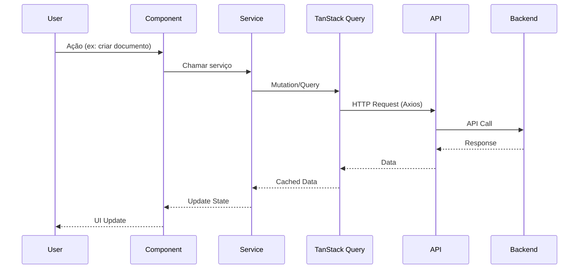

# Ordoc-AI - Documentação Técnica

## Visão Geral

**Ordoc-AI** é uma plataforma de gestão inteligente de documentos e processos jurídicos/administrativos, desenvolvida com foco em **Soberania Digital** e **Inteligência Cognitiva**. A plataforma oferece automação de workflows, assinatura digital, análise preditiva e conformidade com LGPD/Decreto 10.278.

### Stack Tecnológico

| Categoria | Tecnologia | Versão |
|-----------|-----------|--------|
| **Framework** | Next.js | 16.1.1 |
| **Runtime** | React | 19.2.3 |
| **Linguagem** | TypeScript | 5.x |
| **State Management** | Zustand | 5.0.9 |
| **Data Fetching** | TanStack Query | 5.90.16 |
| **Autenticação** | NextAuth | 5.0.0-beta.30 |
| **UI Components** | Radix UI + Shadcn/UI | - |
| **Styling** | Tailwind CSS | 4.1.18 |
| **Forms** | React Hook Form + Zod | 7.71.0 / 4.3.5 |
| **Charts** | Recharts | 3.6.0 |
| **HTTP Client** | Axios | 1.13.2 |
| **Animations** | Framer Motion | 12.25.0 |
| **i18n** | next-intl | 4.7.0 |

### Características Principais

- ✅ **Arquitetura Modular**: Separação clara entre módulos (Dashboard, Analytics, Documents, Processes)
- ✅ **Server-Side Rendering (SSR)**: Performance otimizada com Next.js App Router
- ✅ **Type Safety**: TypeScript em 100% do código
- ✅ **Internacionalização**: Suporte a 13 idiomas (pt-BR, en-US, es-ES, etc.)
- ✅ **Testes Automatizados**: Jest (unit), Cypress (E2E), Testing Library (integration)
- ✅ **Acessibilidade**: WCAG 2.1 AA compliance com jest-axe
- ✅ **Design System**: Componentes reutilizáveis com Shadcn/UI

---

## Índice

1. [Arquitetura](#arquitetura)
2. [Estrutura de Diretórios](#estrutura-de-diretórios)
3. [Módulos Principais](#módulos-principais)
4. [APIs e Serviços](#apis-e-serviços)
5. [Autenticação e Autorização](#autenticação-e-autorização)
6. [State Management](#state-management)
7. [Rotas e Navegação](#rotas-e-navegação)
8. [Componentes](#componentes)
9. [Testes](#testes)
10. [Deploy e CI/CD](#deploy-e-cicd)
11. [Troubleshooting](#troubleshooting)

---

## Arquitetura

Ver [ARCHITECTURE.md](./ARCHITECTURE.md) para diagramas detalhados.

### Arquitetura de Alto Nível

```
┌─────────────────────────────────────────────────────────────┐
│                     FRONTEND (Next.js 16)                    │
├─────────────────────────────────────────────────────────────┤
│  ┌──────────┐  ┌──────────┐  ┌──────────┐  ┌──────────┐   │
│  │Dashboard │  │Analytics │  │Documents │  │Processes │   │
│  └────┬─────┘  └────┬─────┘  └────┬─────┘  └────┬─────┘   │
│       │             │              │              │          │
│  ┌────┴─────────────┴──────────────┴──────────────┴─────┐  │
│  │           Camada de Serviços (API Client)            │  │
│  └────────────────────────┬──────────────────────────────┘  │
└───────────────────────────┼─────────────────────────────────┘
                            │
                   ┌────────┴────────┐
                   │   API Gateway   │
                   │  (Axios + Auth) │
                   └────────┬────────┘
                            │
┌───────────────────────────┼─────────────────────────────────┐
│                    BACKEND (Django/FastAPI)                  │
├─────────────────────────────────────────────────────────────┤
│  ┌──────────┐  ┌──────────┐  ┌──────────┐  ┌──────────┐   │
│  │  Auth    │  │Documents │  │Processes │  │Analytics │   │
│  │ Service  │  │ Service  │  │ Service  │  │ Service  │   │
│  └────┬─────┘  └────┬─────┘  └────┬─────┘  └────┬─────┘   │
│       │             │              │              │          │
│  ┌────┴─────────────┴──────────────┴──────────────┴─────┐  │
│  │                Database Layer (PostgreSQL)            │  │
│  └───────────────────────────────────────────────────────┘  │
└─────────────────────────────────────────────────────────────┘
```

### Fluxo de Dados



---

## Estrutura de Diretórios

```
frontend-ordoc/
├── src/
│   ├── app/                    # Next.js App Router
│   │   ├── (dashboard)/       # Rotas autenticadas
│   │   │   ├── analytics/     # Módulo Analytics
│   │   │   ├── documents/     # Módulo Documents
│   │   │   ├── my-day/        # Dashboard principal
│   │   │   ├── processes/     # Módulo Processes
│   │   │   └── settings/      # Configurações
│   │   ├── api/               # API Routes (Next.js)
│   │   ├── login/             # Página de login
│   │   └── layout.tsx         # Layout raiz
│   ├── components/            # Componentes React
│   │   ├── analytics/         # Componentes de Analytics
│   │   ├── layout/            # Componentes de layout
│   │   ├── my-day/            # Componentes do Dashboard
│   │   ├── ui/                # Componentes base (Shadcn)
│   │   └── ...
│   ├── hooks/                 # Custom React Hooks
│   ├── lib/                   # Utilitários
│   ├── providers/             # Context Providers
│   ├── services/              # Camada de serviços (API)
│   ├── store/                 # Zustand stores
│   └── types/                 # TypeScript types
├── public/                    # Assets estáticos
├── messages/                  # i18n translations
├── test/                      # Testes unitários
├── cypress/                   # Testes E2E
└── docs/                      # Documentação
```

### Convenções de Nomenclatura

- **Componentes**: PascalCase (ex: `DocumentCard.tsx`)
- **Hooks**: camelCase com prefixo `use` (ex: `useDocuments.ts`)
- **Services**: camelCase (ex: `documents.ts`)
- **Types**: PascalCase (ex: `Document.ts`)
- **Constants**: UPPER_SNAKE_CASE (ex: `API_BASE_URL`)

---

## Próximos Arquivos

Esta documentação está dividida em múltiplos arquivos para facilitar a navegação:

- [ARCHITECTURE.md](./ARCHITECTURE.md) - Diagramas de arquitetura detalhados
- [API.md](./API.md) - Documentação completa de APIs
- [COMPONENTS.md](./COMPONENTS.md) - Guia de componentes
- [TESTING.md](./TESTING.md) - Estratégia de testes
- [DEPLOYMENT.md](./DEPLOYMENT.md) - Guia de deploy
- [TROUBLESHOOTING.md](./TROUBLESHOOTING.md) - Solução de problemas
- [CONTRIBUTING.md](./CONTRIBUTING.md) - Guia para contribuidores

---

## Quick Start

```bash
# 1. Instalar dependências
pnpm install

# 2. Configurar variáveis de ambiente
cp .env.example .env.local
# Editar .env.local com suas configurações

# 3. Rodar em desenvolvimento
pnpm dev

# 4. Rodar testes
pnpm test              # Unit tests
pnpm test:e2e          # E2E tests
pnpm test:coverage     # Coverage report

# 5. Build para produção
pnpm build
pnpm start
```

---

## Contato e Suporte

- **Repositório**: [GitHub](https://github.com/adsumtec/frontend-ordoc)
- **Documentação**: `/docs`
- **Issues**: [GitHub Issues](https://github.com/adsumtec/frontend-ordoc/issues)
