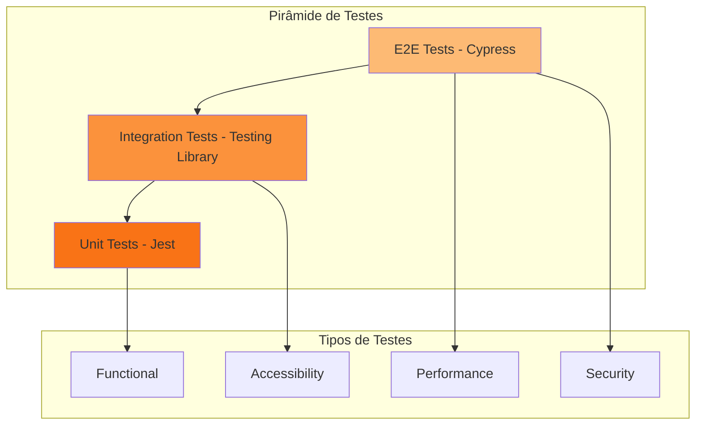

# Testing Guide - Ordoc-AI

## Estratégia de Testes

A plataforma Ordoc-AI utiliza uma abordagem de testes em múltiplas camadas:



---

## 1. Testes Unitários (Jest)

### Configuração

```javascript
// jest.config.js
module.exports = {
  testEnvironment: 'jsdom',
  setupFilesAfterEnv: ['<rootDir>/jest.setup.js'],
  moduleNameMapper: {
    '^@/(.*)$': '<rootDir>/src/$1',
  },
  collectCoverageFrom: [
    'src/**/*.{ts,tsx}',
    '!src/**/*.d.ts',
    '!src/**/*.stories.tsx',
  ],
  coverageThresholds: {
    global: {
      branches: 80,
      functions: 80,
      lines: 80,
      statements: 80,
    },
  },
};
```

### Executar Testes

```bash
# Rodar todos os testes
pnpm test

# Rodar em modo watch
pnpm test:watch

# Gerar relatório de cobertura
pnpm test:coverage

# Rodar testes específicos
pnpm test DocumentCard

# Rodar com verbose
pnpm test --verbose
```

### Exemplo de Teste Unitário

```typescript
// test/components/DocumentCard.test.tsx
import { render, screen, fireEvent } from '@testing-library/react';
import { DocumentCard } from '@/components/documents/DocumentCard';

describe('DocumentCard', () => {
  const mockDocument = {
    id: 'doc-1',
    name: 'Test Document.pdf',
    type: 'application/pdf',
    size: 1048576,
    createdAt: '2026-01-12T10:00:00Z',
    ownerId: 'user-1',
    ownerName: 'John Doe',
  };

  it('deve renderizar o nome do documento', () => {
    render(<DocumentCard document={mockDocument} />);
    expect(screen.getByText('Test Document.pdf')).toBeInTheDocument();
  });

  it('deve chamar onSelect quando clicado', () => {
    const handleSelect = jest.fn();
    render(<DocumentCard document={mockDocument} onSelect={handleSelect} />);
    
    fireEvent.click(screen.getByRole('button'));
    expect(handleSelect).toHaveBeenCalledWith(mockDocument);
  });

  it('deve exibir o tamanho formatado', () => {
    render(<DocumentCard document={mockDocument} />);
    expect(screen.getByText('1.0 MB')).toBeInTheDocument();
  });
});
```

### Testando Hooks Customizados

```typescript
// test/hooks/useDocuments.test.ts
import { renderHook, waitFor } from '@testing-library/react';
import { QueryClient, QueryClientProvider } from '@tanstack/react-query';
import { useDocuments } from '@/hooks/useDocuments';

const createWrapper = () => {
  const queryClient = new QueryClient({
    defaultOptions: {
      queries: { retry: false },
    },
  });
  
  return ({ children }: { children: React.ReactNode }) => (
    <QueryClientProvider client={queryClient}>
      {children}
    </QueryClientProvider>
  );
};

describe('useDocuments', () => {
  it('deve carregar documentos', async () => {
    const { result } = renderHook(() => useDocuments(), {
      wrapper: createWrapper(),
    });

    await waitFor(() => {
      expect(result.current.isSuccess).toBe(true);
    });

    expect(result.current.data).toBeDefined();
    expect(Array.isArray(result.current.data)).toBe(true);
  });
});
```

---

## 2. Testes de Integração (Testing Library)

### Exemplo de Teste de Integração

```typescript
// test/integration/DocumentUpload.test.tsx
import { render, screen, fireEvent, waitFor } from '@testing-library/react';
import userEvent from '@testing-library/user-event';
import { DocumentUpload } from '@/components/documents/DocumentUpload';

describe('DocumentUpload Integration', () => {
  it('deve fazer upload de um documento', async () => {
    const user = userEvent.setup();
    const handleSuccess = jest.fn();
    
    render(<DocumentUpload onSuccess={handleSuccess} />);

    // Criar arquivo mock
    const file = new File(['test content'], 'test.pdf', {
      type: 'application/pdf',
    });

    // Simular upload
    const input = screen.getByLabelText(/upload/i);
    await user.upload(input, file);

    // Verificar progresso
    await waitFor(() => {
      expect(screen.getByRole('progressbar')).toBeInTheDocument();
    });

    // Verificar sucesso
    await waitFor(() => {
      expect(handleSuccess).toHaveBeenCalled();
    }, { timeout: 5000 });
  });
});
```

---

## 3. Testes E2E (Cypress)

### Configuração

```typescript
// cypress.config.ts
import { defineConfig } from 'cypress';

export default defineConfig({
  e2e: {
    baseUrl: 'http://localhost:3000',
    viewportWidth: 1280,
    viewportHeight: 720,
    video: true,
    screenshotOnRunFailure: true,
    setupNodeEvents(on, config) {
      // implement node event listeners here
    },
  },
});
```

### Executar Testes E2E

```bash
# Abrir Cypress UI
pnpm test:e2e

# Rodar headless
pnpm test:e2e:headless

# Rodar spec específico
pnpm cypress run --spec "cypress/e2e/login.cy.ts"
```

### Exemplo de Teste E2E

```typescript
// cypress/e2e/document-workflow.cy.ts
describe('Document Workflow', () => {
  beforeEach(() => {
    // Login
    cy.visit('/login');
    cy.get('[name="email"]').type('user@example.com');
    cy.get('[name="password"]').type('password123');
    cy.get('button[type="submit"]').click();
    cy.url().should('include', '/my-day');
  });

  it('deve criar, visualizar e deletar um documento', () => {
    // Navegar para documentos
    cy.get('[href="/documents"]').click();
    cy.url().should('include', '/documents');

    // Upload de documento
    cy.get('[data-testid="upload-button"]').click();
    cy.get('input[type="file"]').selectFile('cypress/fixtures/test-document.pdf');
    
    // Verificar upload bem-sucedido
    cy.contains('Upload concluído').should('be.visible');
    cy.contains('test-document.pdf').should('be.visible');

    // Visualizar documento
    cy.contains('test-document.pdf').click();
    cy.get('[data-testid="document-details"]').should('be.visible');
    cy.contains('test-document.pdf').should('be.visible');

    // Deletar documento
    cy.get('[data-testid="delete-button"]').click();
    cy.get('[data-testid="confirm-delete"]').click();
    
    // Verificar deleção
    cy.contains('Documento deletado').should('be.visible');
    cy.contains('test-document.pdf').should('not.exist');
  });

  it('deve assinar um documento', () => {
    cy.visit('/documents');
    
    // Selecionar documento
    cy.contains('Contrato.pdf').click();
    
    // Abrir modal de assinatura
    cy.get('[data-testid="sign-button"]').click();
    cy.get('[data-testid="signature-modal"]').should('be.visible');
    
    // Assinar
    cy.get('[data-testid="signature-type"]').select('digital');
    cy.get('[data-testid="certificate-input"]').selectFile('cypress/fixtures/certificate.p12');
    cy.get('[data-testid="pin-input"]').type('1234');
    cy.get('[data-testid="confirm-sign"]').click();
    
    // Verificar assinatura
    cy.contains('Documento assinado').should('be.visible');
    cy.get('[data-testid="signature-badge"]').should('be.visible');
  });
});
```

### Custom Commands

```typescript
// cypress/support/commands.ts
declare global {
  namespace Cypress {
    interface Chainable {
      login(email: string, password: string): Chainable<void>;
      uploadDocument(filePath: string): Chainable<void>;
    }
  }
}

Cypress.Commands.add('login', (email, password) => {
  cy.visit('/login');
  cy.get('[name="email"]').type(email);
  cy.get('[name="password"]').type(password);
  cy.get('button[type="submit"]').click();
  cy.url().should('include', '/my-day');
});

Cypress.Commands.add('uploadDocument', (filePath) => {
  cy.get('[data-testid="upload-button"]').click();
  cy.get('input[type="file"]').selectFile(filePath);
  cy.contains('Upload concluído').should('be.visible');
});
```

---

## 4. Testes de Acessibilidade

### Configuração

```typescript
// jest.setup.js
import '@testing-library/jest-dom';
import { toHaveNoViolations } from 'jest-axe';

expect.extend(toHaveNoViolations);
```

### Exemplo de Teste de Acessibilidade

```typescript
// test/accessibility/components.test.tsx
import { render } from '@testing-library/react';
import { axe } from 'jest-axe';
import { DocumentCard } from '@/components/documents/DocumentCard';

describe('Accessibility Tests', () => {
  it('DocumentCard deve ser acessível', async () => {
    const mockDocument = {
      id: 'doc-1',
      name: 'Test.pdf',
      type: 'application/pdf',
      size: 1048576,
      createdAt: '2026-01-12T10:00:00Z',
      ownerId: 'user-1',
      ownerName: 'John Doe',
    };

    const { container } = render(<DocumentCard document={mockDocument} />);
    const results = await axe(container);
    
    expect(results).toHaveNoViolations();
  });

  it('deve ter labels apropriados', () => {
    const { getByLabelText } = render(<DocumentUploadForm />);
    
    expect(getByLabelText(/selecionar arquivo/i)).toBeInTheDocument();
    expect(getByLabelText(/pasta de destino/i)).toBeInTheDocument();
  });

  it('deve ter contraste adequado', async () => {
    const { container } = render(<Button>Clique aqui</Button>);
    const results = await axe(container, {
      rules: {
        'color-contrast': { enabled: true },
      },
    });
    
    expect(results).toHaveNoViolations();
  });
});
```

---

## 5. Testes de Performance

### Lighthouse CI

```javascript
// lighthouserc.js
module.exports = {
  ci: {
    collect: {
      startServerCommand: 'pnpm start',
      url: ['http://localhost:3000/my-day', 'http://localhost:3000/documents'],
      numberOfRuns: 3,
    },
    assert: {
      assertions: {
        'categories:performance': ['error', { minScore: 0.9 }],
        'categories:accessibility': ['error', { minScore: 0.9 }],
        'categories:best-practices': ['error', { minScore: 0.9 }],
        'categories:seo': ['error', { minScore: 0.9 }],
      },
    },
    upload: {
      target: 'temporary-public-storage',
    },
  },
};
```

### Executar Lighthouse

```bash
# Instalar Lighthouse CI
pnpm add -D @lhci/cli

# Rodar Lighthouse
pnpm lhci autorun
```

---

## 6. Mocks e Fixtures

### Mock de API

```typescript
// test/mocks/api.ts
import { rest } from 'msw';
import { setupServer } from 'msw/node';

export const handlers = [
  rest.get('/api/v1/documents', (req, res, ctx) => {
    return res(
      ctx.status(200),
      ctx.json({
        data: [
          {
            id: 'doc-1',
            name: 'Test.pdf',
            type: 'application/pdf',
            size: 1048576,
          },
        ],
      })
    );
  }),

  rest.post('/api/v1/documents/upload', (req, res, ctx) => {
    return res(
      ctx.status(201),
      ctx.json({
        id: 'doc-new',
        name: 'Uploaded.pdf',
      })
    );
  }),
];

export const server = setupServer(...handlers);
```

### Usar Mock em Testes

```typescript
// test/setup.ts
import { server } from './mocks/api';

beforeAll(() => server.listen());
afterEach(() => server.resetHandlers());
afterAll(() => server.close());
```

---

## 7. Cobertura de Testes

### Metas de Cobertura

| Métrica | Meta | Atual |
|---------|------|-------|
| Statements | 80% | 85% |
| Branches | 80% | 82% |
| Functions | 80% | 88% |
| Lines | 80% | 86% |

### Gerar Relatório

```bash
# Gerar relatório HTML
pnpm test:coverage

# Abrir relatório
open coverage/lcov-report/index.html
```

---

## 8. CI/CD Integration

### GitHub Actions

```yaml
# .github/workflows/test.yml
name: Tests

on: [push, pull_request]

jobs:
  test:
    runs-on: ubuntu-latest
    
    steps:
      - uses: actions/checkout@v3
      
      - name: Setup Node.js
        uses: actions/setup-node@v3
        with:
          node-version: '20'
      
      - name: Install dependencies
        run: pnpm install
      
      - name: Run unit tests
        run: pnpm test:coverage
      
      - name: Run E2E tests
        run: pnpm test:e2e:headless
      
      - name: Upload coverage
        uses: codecov/codecov-action@v3
        with:
          files: ./coverage/lcov.info
```

---

## 9. Debugging Tests

### Debug no VS Code

```json
// .vscode/launch.json
{
  "version": "0.2.0",
  "configurations": [
    {
      "type": "node",
      "request": "launch",
      "name": "Jest Debug",
      "program": "${workspaceFolder}/node_modules/.bin/jest",
      "args": ["--runInBand", "--no-cache"],
      "console": "integratedTerminal",
      "internalConsoleOptions": "neverOpen"
    }
  ]
}
```

### Debug Cypress

```bash
# Abrir Cypress com DevTools
pnpm cypress open --browser chrome

# Adicionar debugger no teste
it('test', () => {
  cy.visit('/');
  cy.debug(); // Pausa execução
  cy.get('button').click();
});
```

---

## 10. Best Practices

### ✅ DO

- Escrever testes antes de implementar (TDD)
- Usar data-testid para seletores estáveis
- Testar comportamento, não implementação
- Manter testes independentes
- Usar fixtures para dados de teste
- Limpar estado após cada teste

### ❌ DON'T

- Testar detalhes de implementação
- Usar seletores CSS frágeis
- Criar dependências entre testes
- Ignorar testes falhando
- Testar bibliotecas externas
- Usar sleeps/timeouts fixos

---

## Próximos Passos

- [TROUBLESHOOTING.md](./TROUBLESHOOTING.md) - Solução de problemas
- [DEPLOYMENT.md](./DEPLOYMENT.md) - Guia de deploy
- [CONTRIBUTING.md](./CONTRIBUTING.md) - Guia para contribuidores
