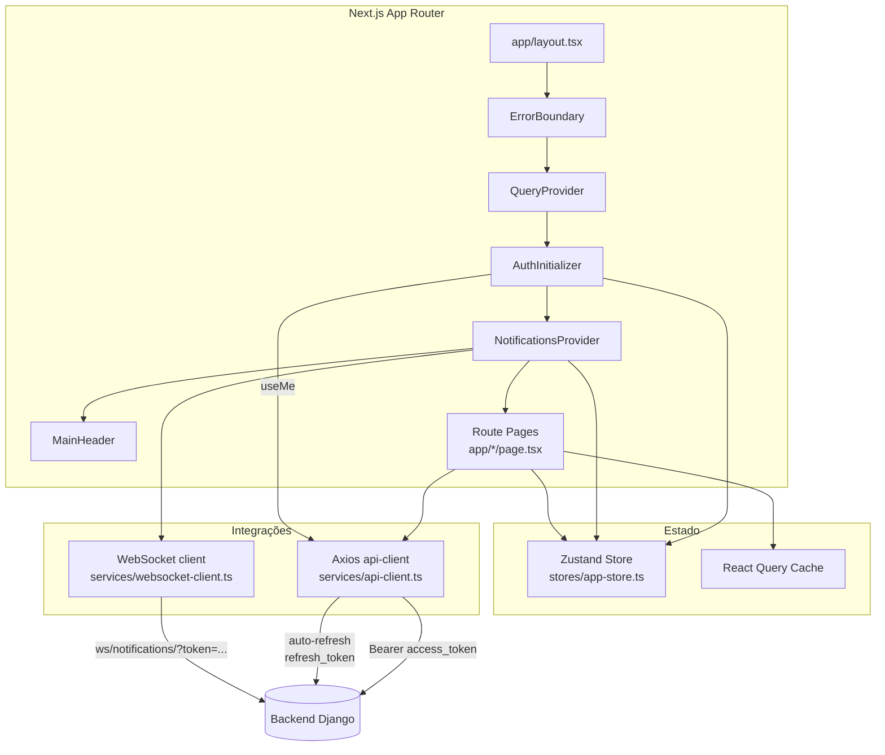
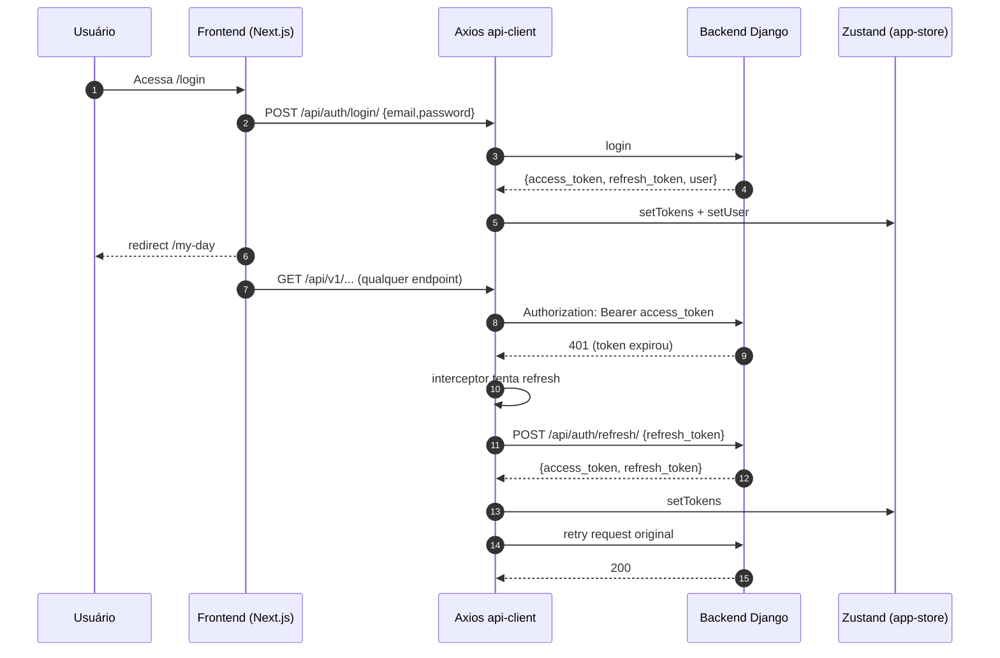
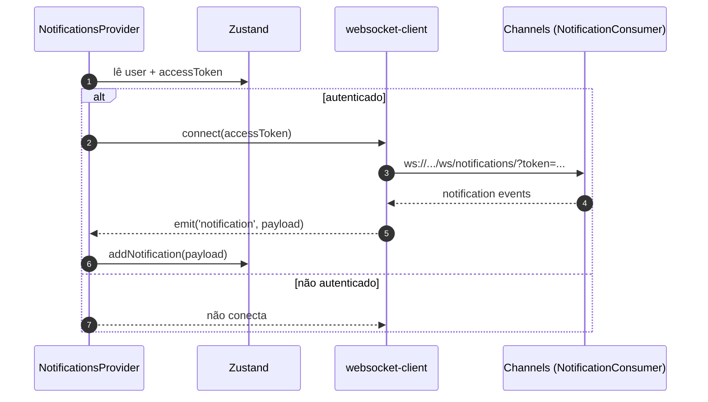

# Frontend New — Arquitetura (Next.js)

Este documento descreve a arquitetura do **frontend-new** (Next.js App Router), seus módulos e como ele se integra ao backend.

## Stack

- Next.js (App Router)
- React Query (`@tanstack/react-query`)
- Zustand (`zustand` + persist)
- Axios (`axios`) com interceptors (auth + auto-refresh)
- WebSocket (notificações) via Channels
- UI: shadcn/ui + Radix

## Entry points e providers globais

- `frontend-new/app/layout.tsx`
  - `ErrorBoundary`
  - `QueryProvider` (React Query)
  - `AuthInitializer` (carrega `/api/auth/me/`)
  - `NotificationsProvider` (abre WS quando autenticado)
  - `MainHeader` (navegação)

## Navegação (IA / Documentos / Processos / Assinaturas)

O `MainHeader` define o menu principal (e o oculta em `/login`):

- `/my-day` (dashboard)
- `/documents` (gestão documental)
- `/processes` (kanban de tarefas/workflows)
- `/signatures` (certificados e solicitações de assinatura)
- `/analyses` (análises/relatórios)

Arquivos:
- `frontend-new/app/components/main-header.tsx`
- `frontend-new/app/page.tsx` redireciona para `/my-day`

## Camada de serviços (API)

A camada `services/*-api.ts` concentra os endpoints do backend.

- `services/auth-api.ts`
  - `POST /api/auth/login/`, `POST /api/auth/refresh/`, `GET /api/auth/me/`
- `services/documents-api.ts`
  - base: `/api/v1/ordoc-air`
- `services/my-day-api.ts`
  - agrega chamadas em `/api/v1/ordoc-flow`, `/api/v1/ordoc-air`, `/api/v1/ordoc-sign`
- `services/signatures-api.ts`
  - base: `/api/v1/ordoc-sign`
- `services/websocket-client.ts`
  - WS: `/ws/notifications/?token=...`

## Auth + token refresh

## Notificações (WebSocket)

