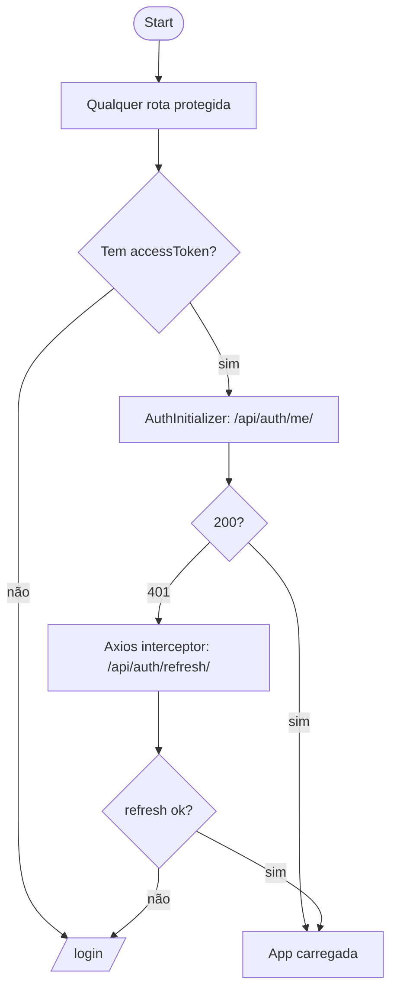

# Frontend New — Fluxo de Navegação (User Journey)

Fluxo de navegação do usuário (alto nível), a partir das rotas observadas em `frontend-new/app/`.

## Mapa de rotas principais

- `/` → redireciona para `/my-day`
- `/login`
- `/my-day`
- `/documents`
- `/processes`
- `/signatures`
- `/analyses`
- `/alerts` (alertas/IA)

## Fluxo principal (autenticado)

```mermaid
flowchart TB
  Start([Start]) --> R0[/ /]
  R0 -->|redirect| MyDay[/my-day/]

  MyDay -->|nav| Docs[/documents/]
  MyDay -->|nav| Proc[/processes/]
  MyDay -->|nav| Sig[/signatures/]
  MyDay -->|nav| Ana[/analyses/]

  %% Documentos
  Docs --> D1[Ver listas + filtros]
  D1 --> D2[Selecionar documento/pasta]
  D2 --> D3[Preview/Detalhes]
  D3 --> D4[Download]
  D3 --> D5[Favoritar/Arquivar/Compartilhar]
  Docs --> D6[Upload de documento]

  %% Processos
  Proc --> P1[Ver Kanban]
  P1 --> P2[Mover tarefa entre colunas]
  P2 --> P3[Chamar API transition status]
  P1 --> P4[Abrir sidebar detalhes]
  Proc --> P5[Criar procedimento]

  %% Assinaturas
  Sig --> S1[Solicitações]
  S1 --> S2[Ver detalhe]
  S1 --> S3[Criar solicitação]
  Sig --> S4[Ferramentas]
  S4 --> S5[Gerenciar certificados (upload/definir padrão)]
  S4 --> S6[Validar assinatura]
  S4 --> S7[Ver logs/auditoria]

  %% Notificações
  MyDay --> N1[Dropdown notificações]
  N1 --> N2[Marcar como lida]

  End([End])
```

## Fluxo de autenticação (gate)



## Observação sobre multi-tenant no frontend

O backend aplica tenant por header `X-API-Subdomain`/`X-Subdomain`. No `frontend-new`, **não encontrei no `api-client.ts`** um interceptor adicionando esse header; isso normalmente implica que:

- ou o backend está aceitando um modo single-tenant em dev
- ou o tenant é resolvido por outra estratégia no frontend (ex.: subdomínio real do host, proxy/Nginx)

Se você quiser, eu posso localizar onde (ou se) o frontend define o subdomínio/tenant (env, cookie, storage, host-based routing) e adicionar isso no diagrama.
