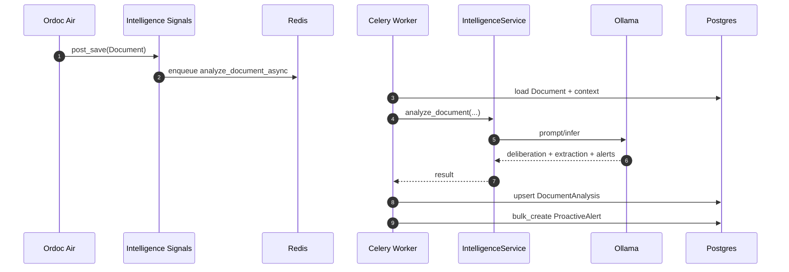
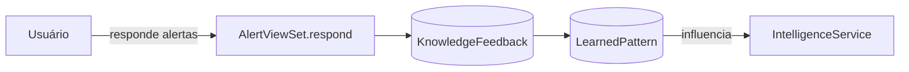

# Intelligence — Arquitetura da IA Proativa

O módulo `intelligence` atua de forma **reativa e proativa**:

- reage a eventos do sistema (signals)
- enfileira análises assíncronas
- persiste resultados e alertas
- expõe endpoints REST para análise e feedback

## Visão geral

```mermaid
flowchart TB
  subgraph Events[Eventos do Sistema]
    DOC[Document created/updated]
    TASK[Task status changed]
    SIGN[SignatureRequest completed]
    AUTH[user_logged_in / login_failed]
  end

  DOC --> SIG[signals.py]
  TASK --> SIG
  SIGN --> SIG
  AUTH --> SIG

  SIG -->|enqueue| CEL[Celery tasks]
  CEL --> SVC[IntelligenceService]
  SVC --> LLM[(Ollama / LLM)]

  CEL --> DB[(Postgres)
DocumentAnalysis / ProactiveAlert]

  API[DRF API
/intelligence] --> DB
  API --> SVC
```

## Vector DB / RAG (embeddings)

- **Status atual**
  - **Não identificado no backend** o uso de Vector DB/Vector Store (ex.: FAISS/Chroma/Qdrant/pgvector).
  - O `IntelligenceService` (código) faz:
    - extração/classificação via extractor
    - deliberação via LLM (Ollama)
    - persistência de resultados/alertas em **Postgres** (`DocumentAnalysis`, `ProactiveAlert`).
- **Implicação arquitetural**
  - Se a estratégia desejada for RAG (recuperação por embeddings), é necessário adicionar explicitamente:
    - geração de embeddings
    - armazenamento (Vector DB)
    - etapa de retrieval e composição de contexto antes da deliberação do LLM.

## Fluxo: criação de documento → alertas proativos



## Feedback loop (aprendizado)


