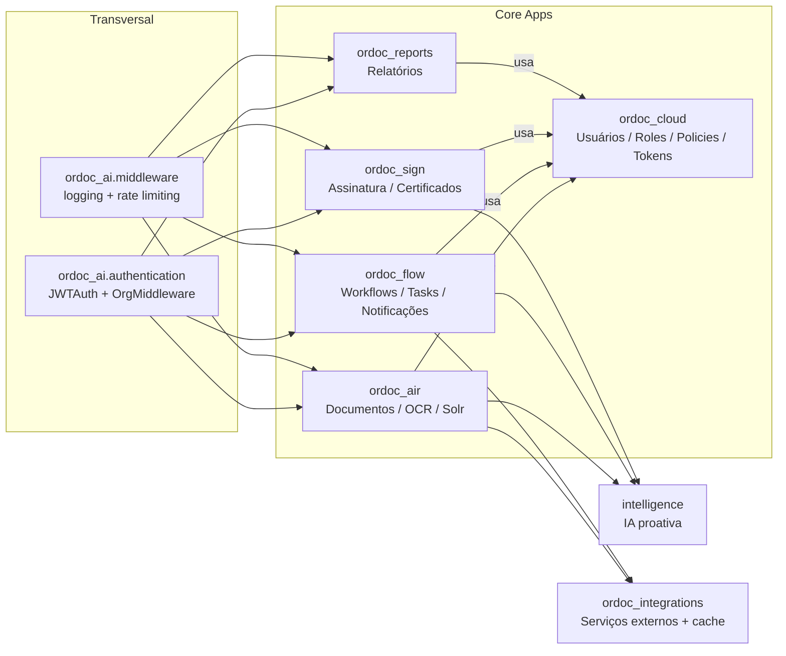
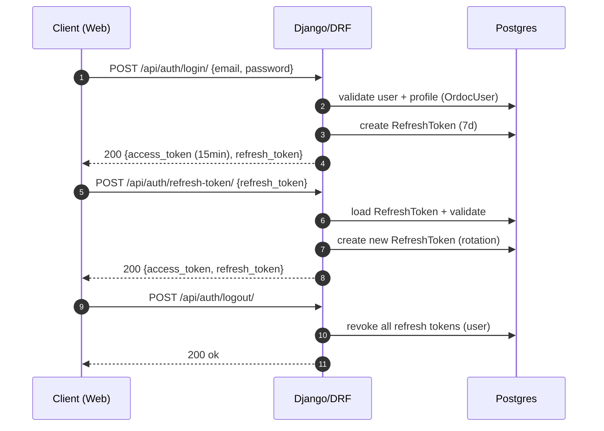
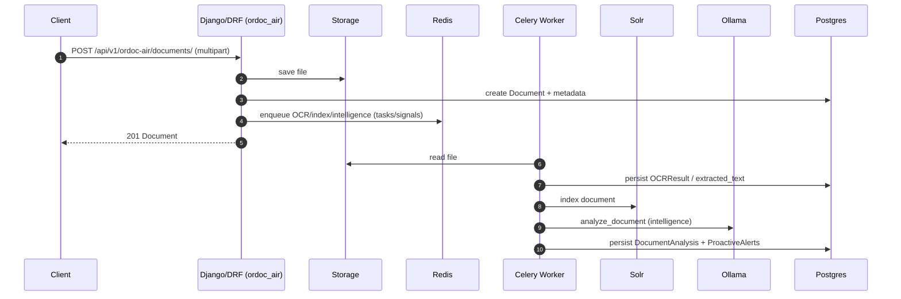
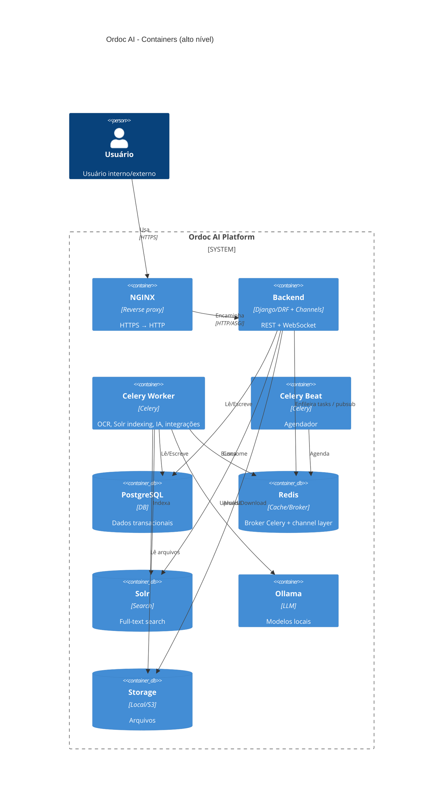

# Ordoc AI — Arquitetura do Sistema (Backend Django)

Esta seção detalha o backend **Django/DRF** e seus módulos internos.

## Módulos (apps) e responsabilidades

## Gaps críticos (status atual no código)

- **Assinatura ICP-Brasil**
  - Existe no backend via `ordoc_sign`.
  - Evidências:
    - `backend/ordoc_sign/models.py`: `DigitalCertificate` com `certificate_type` `A1`/`A3`.
    - `backend/ordoc_sign/services.py`: uso de `pyhanko` (quando disponível) para assinatura de PDF e processamento de certificados.
    - `backend/ordoc_sign/urls.py`: rotas `certificates`, `templates`, `requests`, `signers`, `signatures`, `batches`, `audit-logs`.

- **Multi-tenancy (Org) + separação Interno vs Externo/Cidadão**
  - Tenant é resolvido por header (`X-API-Subdomain`/`X-Subdomain`) e armazenado no request.
  - Evidências:
    - `backend/ordoc_ai/authentication.py`: `OrganizationMiddleware` + `JWTAuthentication.get_organization_from_request()`.
    - `backend/ordoc_ai/base_viewset.py`: `get_current_user()` pode retornar `User` (interno) ou `ExternalRequester` (externo), e `get_current_organization()` é central.

- **Portal externo (Solicitantes externos / OrdocCidadao)**
  - Existe como endpoints dedicados no `ordoc_flow`.
  - Evidências:
    - `backend/ordoc_flow/urls.py`: rotas `api/external/...`.
    - `backend/ordoc_flow/external_views.py`: `ExternalProcedureViewSet`, `ExternalProcedureTemplateViewSet`, `ExternalTaskViewSet`.

- **Vector DB / RAG (embeddings)**
  - **Não identificado no backend atual** (não há Vector DB/VectorStore em uso no módulo `intelligence`).
  - O `intelligence` hoje executa extração/classificação + deliberação via LLM e persiste `DocumentAnalysis/ProactiveAlert` em Postgres.

## Fluxo: autenticação interna + refresh token

## Fluxo: upload de documento → OCR → indexação Solr → IA

## Diagrama C4 (nível container)

