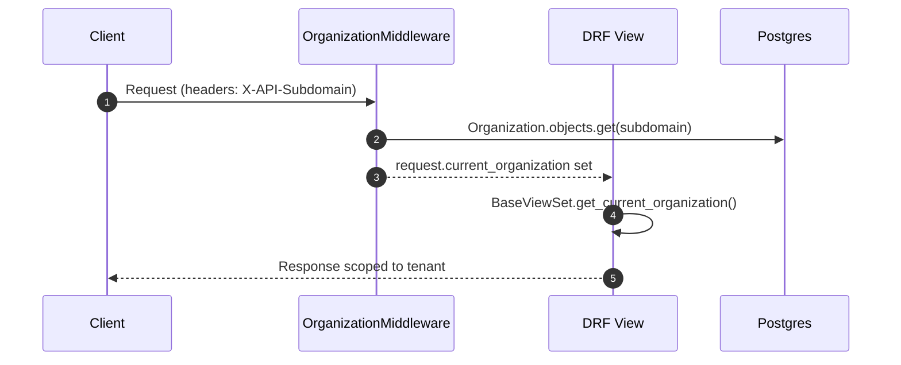
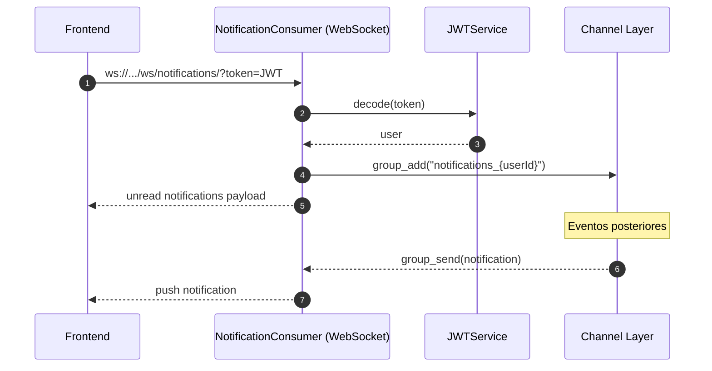
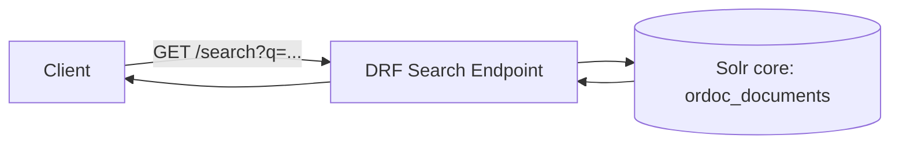

# Ordoc AI — Fluxos Principais (explodidos)

## 1) Multi-tenant: resolução de organização por subdomínio/header

```mermaid
sequenceDiagram
  autonumber
  participant C as Client
  participant MW as OrganizationMiddleware
  participant API as DRF View
  participant DB as Postgres

  C->>MW: Request (headers: X-API-Subdomain)
  MW->>DB: Organization.objects.get(subdomain)
  MW-->>API: request.current_organization set
  API->>API: BaseViewSet.get_current_organization()
  API-->>C: Response scoped to tenant
```

## 2) Notificações em tempo real (Channels)

```mermaid
sequenceDiagram
  autonumber
  participant FE as Frontend
  participant WS as NotificationConsumer (WebSocket)
  participant JWT as JWTService
  participant CH as Channel Layer

  FE->>WS: ws://.../ws/notifications/?token=JWT
  WS->>JWT: decode(token)
  JWT-->>WS: user
  WS->>CH: group_add("notifications_{userId}")
  WS-->>FE: unread notifications payload

  Note over CH: Eventos posteriores
  CH-->>WS: group_send(notification)
  WS-->>FE: push notification
```

## 3) Busca de documentos (Solr)

```mermaid
flowchart LR
  FE[Client] -->|GET /search?q=...| API[DRF Search Endpoint]
  API --> SOLR[(Solr core: ordoc_documents)]
  SOLR --> API
  API --> FE
```
