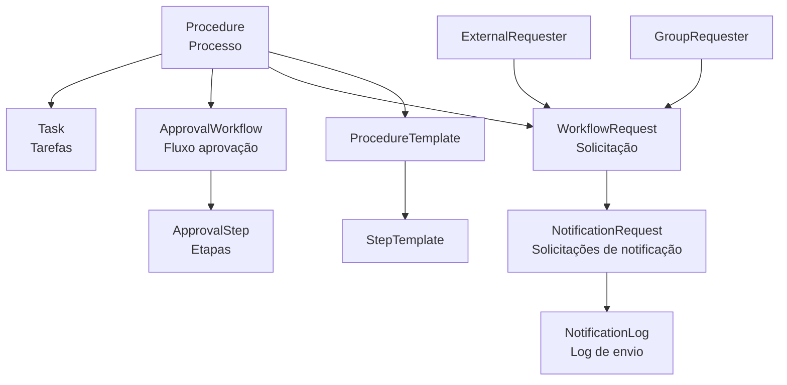
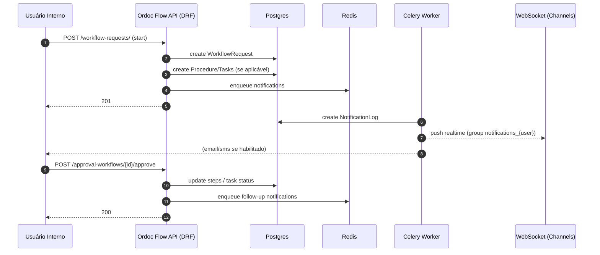
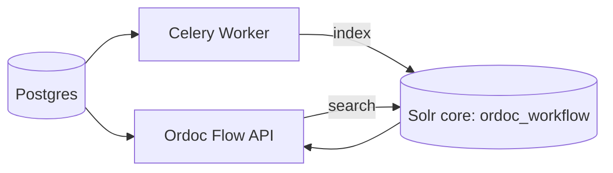

# Ordoc Flow — Arquitetura do Sistema de Workflow

O **Ordoc Flow** é o subsistema de workflow: procedimentos, tarefas, aprovações, notificações e automações.

## Domínios principais

## Portal externo (Cidadão / solicitante externo)

No código existe uma camada específica para o portal externo (referido como **OrdocCidadao**), com endpoints dedicados.

- **Rotas**
  - `backend/ordoc_flow/urls.py`: prefixo `api/external/`.
- **Views**
  - `backend/ordoc_flow/external_views.py`:
    - `ExternalProcedureViewSet`
    - `ExternalProcedureTemplateViewSet`
    - `ExternalTaskViewSet`
- **Autenticação**
  - Usa JWT **do `ExternalRequester`** (token criado por `ExternalRequester.get_token()`), decodificado por `ordoc_ai.authentication.JWTAuthentication`.
- **Multi-tenancy**
  - Mesmo no portal externo, o tenant é aplicado via `BaseViewSet.get_current_organization()` (resolvido por header `X-API-Subdomain`/`X-Subdomain`).

## Fluxo: criar solicitação → gerar tarefas → aprovações → notificar

## Busca no Workflow (Solr)

## Pontos de integração com outros subsistemas

- **Autenticação/tenant**: herdado do núcleo (`ordoc_ai.authentication` + OrganizationMiddleware).
- **Notificações**: pode usar tanto **DB** (Notification/NotificationLog) quanto **WebSocket** via Channels.
- **Integrações**: consumo do `ordoc_integrations` para validações e serviços externos.
- **IA (intelligence)**: signals podem reagir a mudanças de status em `Task`.
