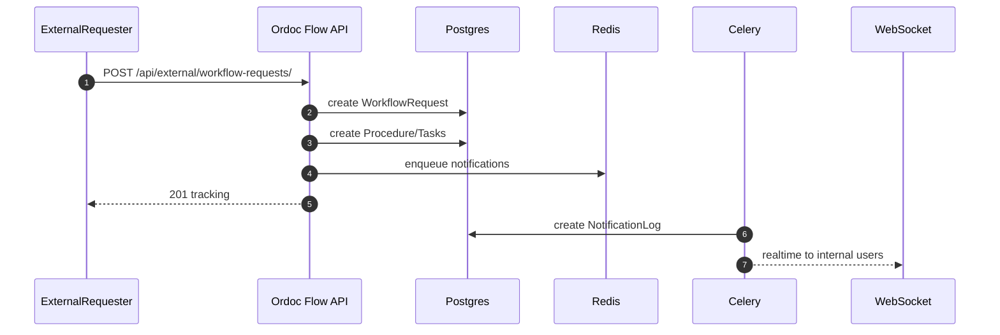
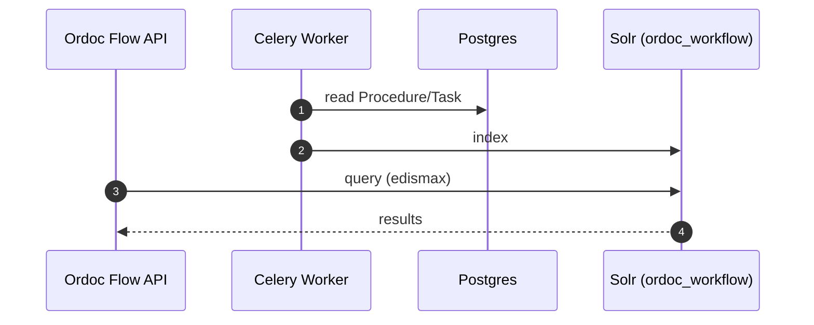

# Ordoc Flow — Fluxos Principais (explodidos)

## 1) “Pedido externo” (solicitação) → workflow interno

```mermaid
sequenceDiagram
  autonumber
  participant EXT as ExternalRequester
  participant API as Ordoc Flow API
  participant DB as Postgres
  participant R as Redis
  participant CW as Celery
  participant WS as WebSocket

  EXT->>API: POST /api/external/workflow-requests/
  API->>DB: create WorkflowRequest
  API->>DB: create Procedure/Tasks
  API->>R: enqueue notifications
  API-->>EXT: 201 tracking

  CW->>DB: create NotificationLog
  CW-->>WS: realtime to internal users
```

## 2) Indexação e busca de workflow (Solr)

```mermaid
sequenceDiagram
  autonumber
  participant API as Ordoc Flow API
  participant CW as Celery Worker
  participant DB as Postgres
  participant SOLR as Solr (ordoc_workflow)

  CW->>DB: read Procedure/Task
  CW->>SOLR: index

  API->>SOLR: query (edismax)
  SOLR-->>API: results
```
