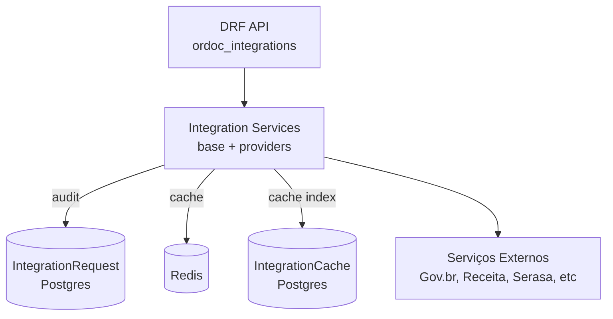
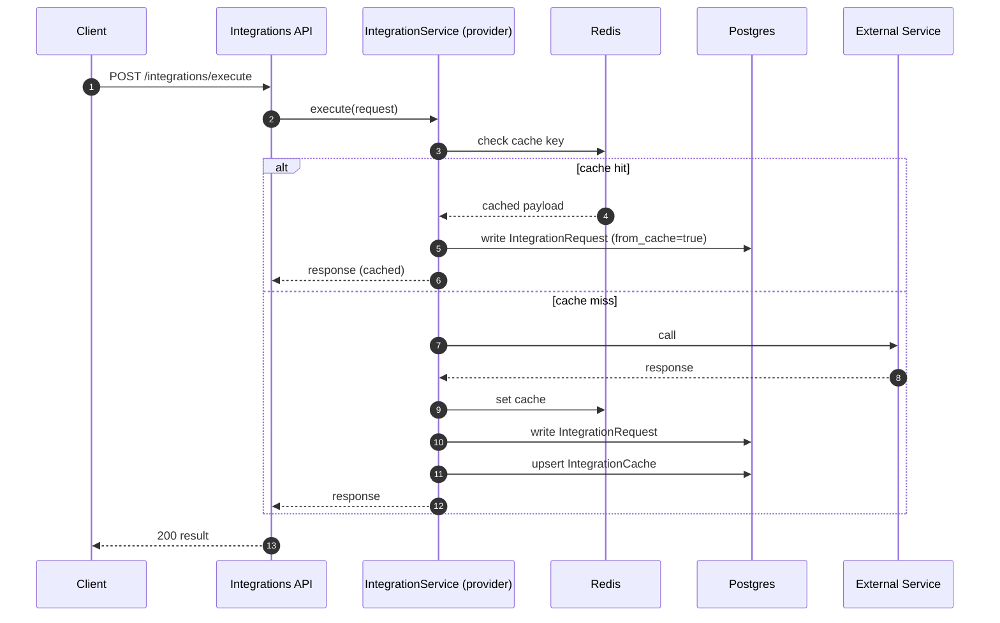

# Ordoc Integrations — Arquitetura de Integrações Externas

O módulo de integrações fornece uma camada padronizada para chamadas a serviços externos, com:

- auditoria (registro de requisições)
- cache (Redis + DB)
- rate limiting
- retries e tratamento de falhas

## Visão do subsistema

## Fluxo: execução com cache + auditoria

## Observações de multi-tenant

A auditoria e cache tendem a incluir `organization` nos modelos (`IntegrationRequest`, etc.).
Para isolamento correto, o tenant deve ser resolvido **de forma única** (preferencialmente via `request.current_organization`).
