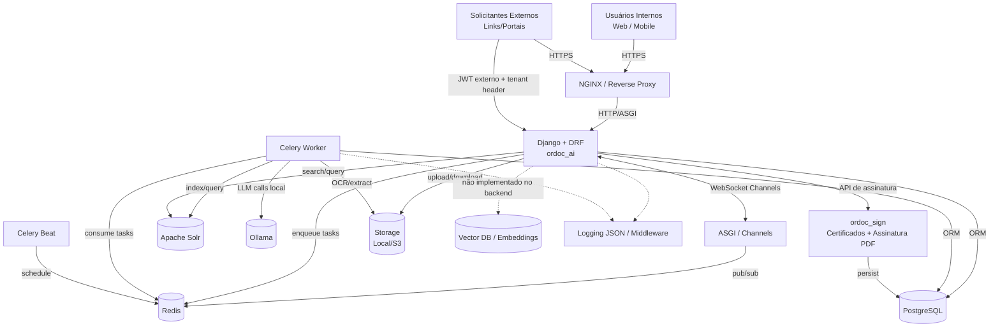

# Visão Geral da Plataforma (Ordoc AI)

## Componentes principais

- **NGINX**
  - Termina TLS (quando configurado) e roteia tráfego HTTP para o backend.
- **Django + DRF (ordoc_ai)**
  - Exposição de APIs REST.
  - Autenticação JWT + refresh token.
  - Multi-tenant por `Organization` (subdomain/header).
- **Channels (WebSocket)**
  - Notificações em tempo real (ex.: `NotificationConsumer`).
- **Redis**
  - Broker Celery.
  - Canal de pub/sub (Channels).
  - (Opcional) cache para integrações e rate limiting.
- **Celery Worker / Beat**
  - OCR, indexação Solr, integrações externas, jobs periódicos.
- **PostgreSQL**
  - Persistência dos domínios (Documentos, Workflow, Users/Roles, Tokens, etc.).
- **Solr**
  - Busca full-text e “search experience”.
- **Ollama**
  - Execução local de LLM para o módulo `intelligence`.
- **Assinatura digital (ordoc_sign)**
  - Certificados digitais (A1/A3) e assinatura de PDF (camada de serviço com `pyhanko`).
- **Portal externo (OrdocCidadao / ExternalRequester)**
  - Endpoints externos do `ordoc_flow` para procedimentos/tarefas de solicitantes externos.
- **Vector DB / RAG**
  - **Não identificado no backend atual** (sem `faiss/chroma/qdrant/pgvector` etc). Se a estratégia for RAG, precisa ser adicionada explicitamente.
- **Storage (Local/S3)**
  - Arquivos (PDFs/imagens) e anexos.
