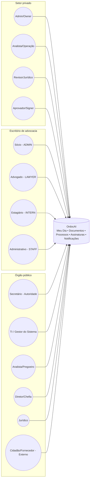

# Usabilidade — Atores & responsabilidades

## Mapa de atores (alto nível)

## Responsabilidades por setor

### Empresa/consultoria

- **Admin/Owner**
  - Onboarding (CNPJ), criação do tenant, configuração mínima, convite de usuários.
  - Governança básica (pastas/tags), regras internas.
  - Visibilidade: resumo do que está urgente e do que depende de assinatura/aprovação.

- **Analista/Operação**
  - Upload e organização de documentos.
  - Iniciar workflows a partir de documentos.
  - Executar etapas e entregar evidências.

- **Revisor/Jurídico**
  - Revisar documentos e riscos.
  - Aprovar antes do envio.

- **Aprovador/Signer**
  - Assinar e/ou aprovar etapas críticas.

### Escritório de advocacia

- **Sócio (ADMIN)**
  - Configurar regras de prazos e alertas.
  - Integrar tribunais e manter credenciais/certificados.
  - Fazer escalonamento e auditoria.

- **Advogado (LAWYER)**
  - Operar “Meu Dia” por prioridades (prazos hoje/semana, intimações).
  - Produzir peças e protocolar (via integração).

- **Estagiário (INTERN)**
  - Apoio na organização de documentos/minutas, com permissões limitadas.

- **Administrativo (STAFF)**
  - Apoio operacional (cadastros, suporte interno), com segregação.

### Órgão público

- **TI / Gestor do Sistema**
  - Implantação, estrutura organizacional, perfis/roles.
  - Configuração de compliance (LAI, e-ARQ, LGPD).

- **Analista/Pregoeiro**
  - Criar processos (pregão, contrato etc.), anexar documentos, operar etapas.

- **Diretor/Chefia**
  - Aprovações intermediárias, cobrança de SLA.

- **Jurídico**
  - Pareceres e validações.

- **Secretário/Autoridade**
  - Assinatura/decisão final, necessidade de justificativa e trilha de auditoria.

- **Cidadão/Fornecedor (externo)**
  - Portal externo para solicitações/acompanhamento (quando habilitado).
