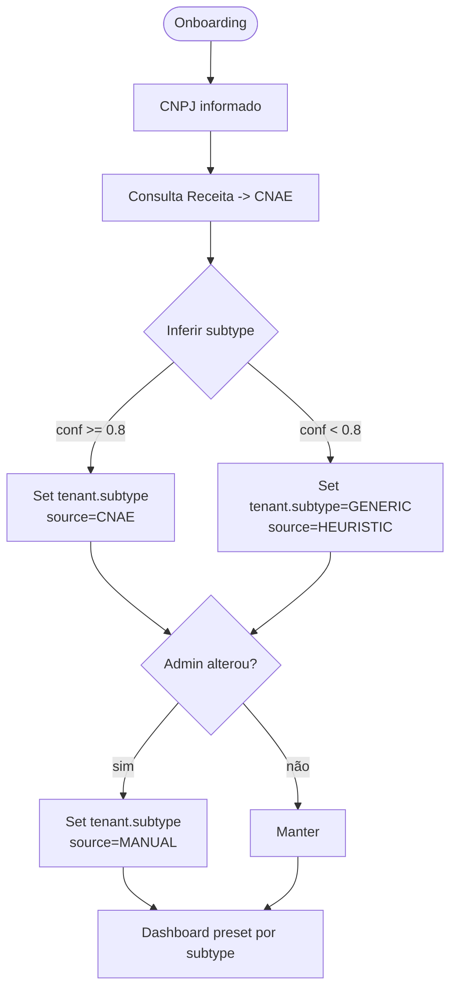
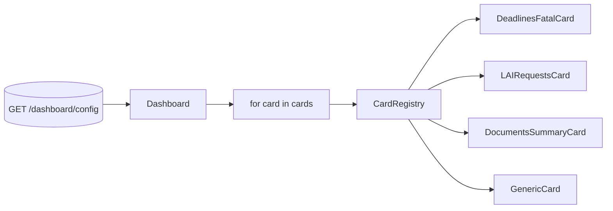

# Estratégia — Dashboard adaptativo (Meu Dia)

Este documento descreve uma estratégia **escalável** para adaptar o dashboard **Meu Dia** por segmento/ramo, sem amarrar o produto a um conjunto fixo e fechado de “atores”.

## Objetivo

- Entregar um **dashboard padrão excelente** (time-to-value) para cada segmento.
- Permitir evolução para novos segmentos sem reescrever frontend.
- Manter **governança**: permissões, auditabilidade e possibilidade de override.

## Princípios

1. **Cards core** sempre presentes (base do produto)

   - Ex.: `documents_summary`, `tasks_priority`, `alerts_intelligence`.
2. **Cards por segmento** ativados automaticamente

   - Baseado em `tenant.type/subtype`.
3. **Personalização opcional**

   - Admin do tenant pode reordenar/ocultar.
   - Usuário pode fixar favoritos.
4. **Telemetria orienta evolução**

   - Ajuste de presets por uso real, não por suposições.

## Taxonomia mínima (estável)

A taxonomia precisa ser pequena e durável:

- `tenant.type`

  - `ORGANIZATION`
  - `PUBLIC_AGENCY`
  - (opcional) `PERSONAL`
- `tenant.subtype` (exemplos iniciais)

  - `LAW_FIRM` (advocacia)
  - `BIDDING_CONSULTING` (consultoria/licitações)
  - `MUNICIPAL_SECRETARIAT` (secretaria municipal)
  - `GENERIC` (fallback)
- `roles` (papéis do usuário) — transversal

  - `ADMIN`, `MANAGER`, `ANALYST`, `LEGAL`, `SIGNER`, `STAFF`, `EXTERNAL`

A recomendação é tratar a maioria dos comportamentos do dashboard como **capabilities/features**, e não como “segmento puro”.

## Segmentação automática (CNPJ/CNAE) — como e quando usar

### Fontes para inferência

- CNAE principal (CNPJ)
- Fluxo de onboarding (ex.: órgão público não é self-serve)
- Integrações habilitadas (ex.: tribunais, DOE, Gov.br)
- Templates de workflow aplicados (pregão/LAI)

### Campo de rastreabilidade

Para manter auditável:

- `tenant.subtype_source`: `CNAE` | `MANUAL` | `CONTRACT` | `HEURISTIC`
- `tenant.subtype_confidence`: float 0..1

### Regras

- CNAE é um **bootstrap** (define o preset inicial), mas não deve impedir override.
- Admin pode **reclassificar** o segmento/subtipo (com log).



## Contrato do endpoint (backend)

### Endpoint sugerido

- `GET /api/v1/dashboard/config/`

Retorna:

- greeting/summary
- lista ordenada de cards
- capabilities/features (para condicionar UI)

Exemplo de payload:

```json
{
  "tenant": {
    "type": "PUBLIC_AGENCY",
    "subtype": "MUNICIPAL_SECRETARIAT",
    "subtype_source": "CONTRACT",
    "subtype_confidence": 1.0
  },
  "user": {
    "roles": ["ANALYST"],
    "permissions": ["documents.read", "procedures.create"]
  },
  "features": {
    "lai": true,
    "doe_publication": true,
    "court_integrations": false
  },
  "summary": {
    "greeting": "Bom dia, Maria",
    "summary_text": "Você tem 2 pedidos LAI vencendo e 3 publicações pendentes"
  },
  "cards": [
    {"type": "lai_requests", "priority": 1},
    {"type": "pending_publications", "priority": 2},
    {"type": "compliance_score", "priority": 3},
    {"type": "tasks_priority", "priority": 4}
  ]
}
```

### Regra de composição (híbrida)

1. Preset de `cards_core`.
2. Adiciona preset por `tenant.subtype`.
3. Filtra por permissões do usuário.
4. Aplica overrides do tenant.
5. Aplica overrides do usuário.

## Registry de cards (frontend)

No frontend, a UI não deve “conhecer segmentos”, apenas **tipos de card**.

- `Dashboard` recebe `cards[]` do backend.
- Um registry mapeia `type -> Component`.
- Fallback para `GenericCard`.



## Customização (modelo de dados)

### Níveis de configuração

- **Tenant-level**: padrão da organização.
- **User-level**: preferências individuais.

Campos essenciais:

- `cards`: lista ordenada de tipos + flags (visível, tamanho)
- `updated_by`, `updated_at`

**Importante:** manter um preset “resetável” para evitar configuração quebrada.

## Telemetria recomendada

Eventos mínimos:

- `dashboard.card_viewed` (card type)
- `dashboard.card_clicked` (cta)
- `dashboard.card_hidden`
- `dashboard.card_reordered`

Objetivo:

- Descobrir quais cards entregam ação/valor por segmento.

## Como lidar com novos segmentos

Quando surgir um novo ramo:

1. Criar novo `subtype` (ou apenas ativar features) e preset inicial.
2. Implementar cards específicos se necessário.
3. Medir uso.
4. Refinar preset.

## Observação

O **segmento** inicial pode vir de CNAE, mas o design deve ser orientado por:

- papéis/permissions
- capabilities/features habilitadas
- workflows usados

Isso evita um produto “hardcoded” para 3 setores.
