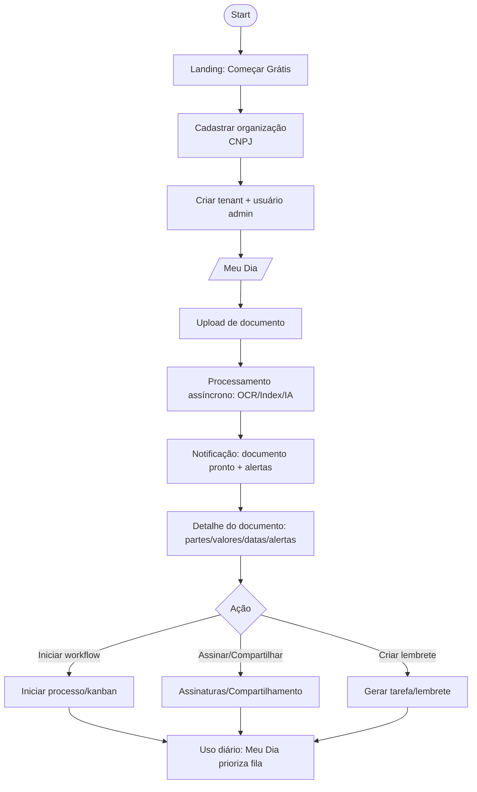
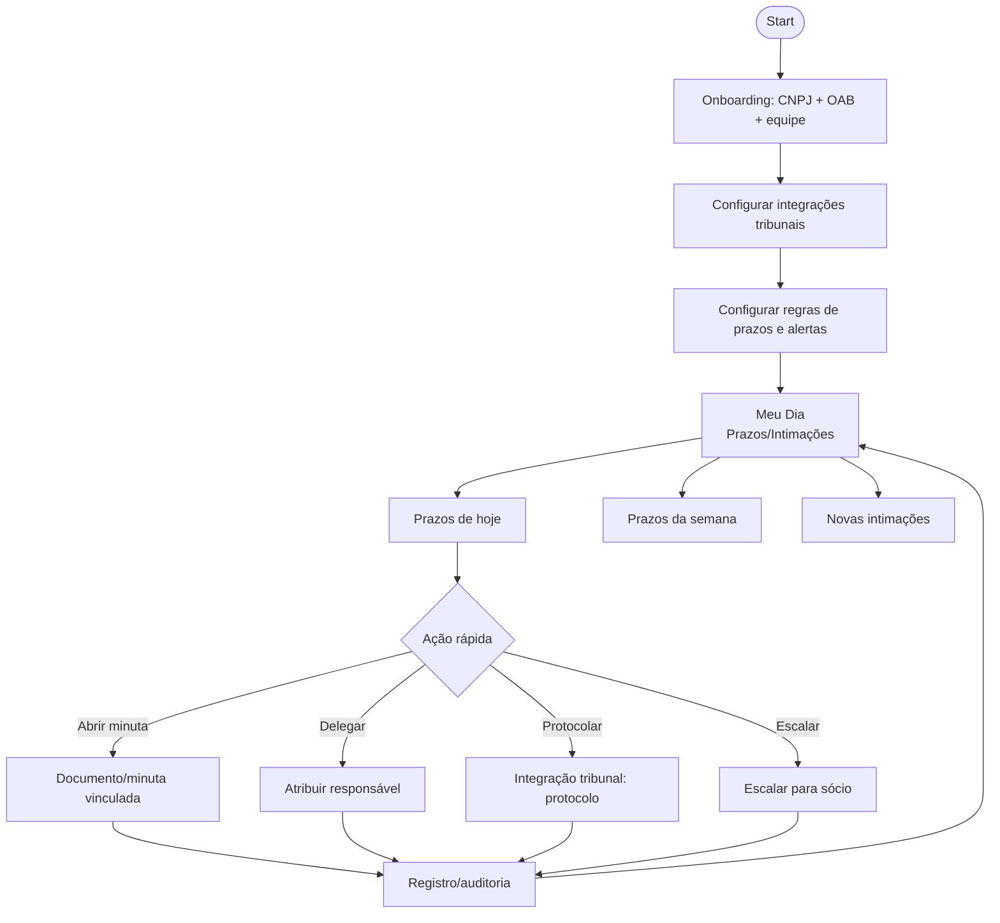
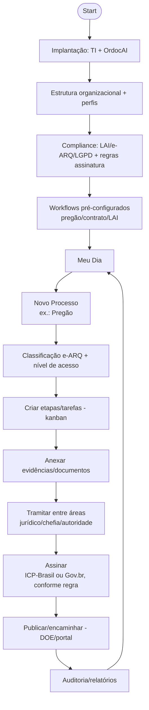

# Usabilidade — Jornadas (User Journeys)

## Jornada A — Empresa/Consultoria (valor rápido via upload)

**Critérios de usabilidade:**
- Resultado perceptível em poucos segundos (status + notificação).
- Edição/controle sobre sugestões IA.

## Jornada B — Advocacia (prazos e intimações como centro)

**Critérios de usabilidade:**
- Priorização sem ambiguidade (risco de prazo).
- Status claro das integrações (conectado/erro/expirado).

## Jornada C — Órgão público (processo formal + compliance + assinatura)

**Critérios de usabilidade:**
- Reduzir fricção em campos de classificação/sigilo.
- Justificativas e trilha de auditoria sempre acessíveis.
